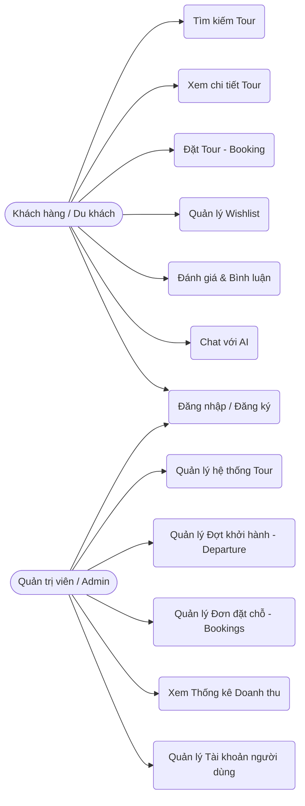
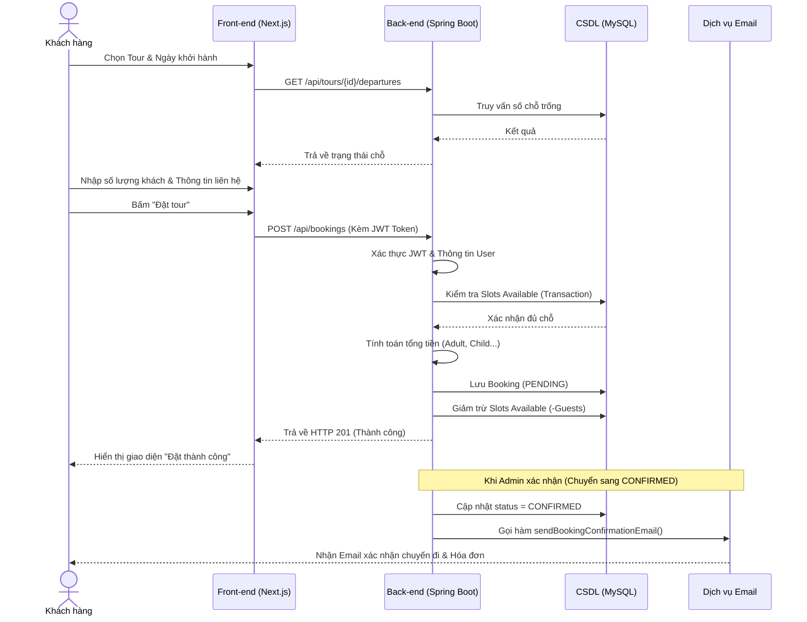
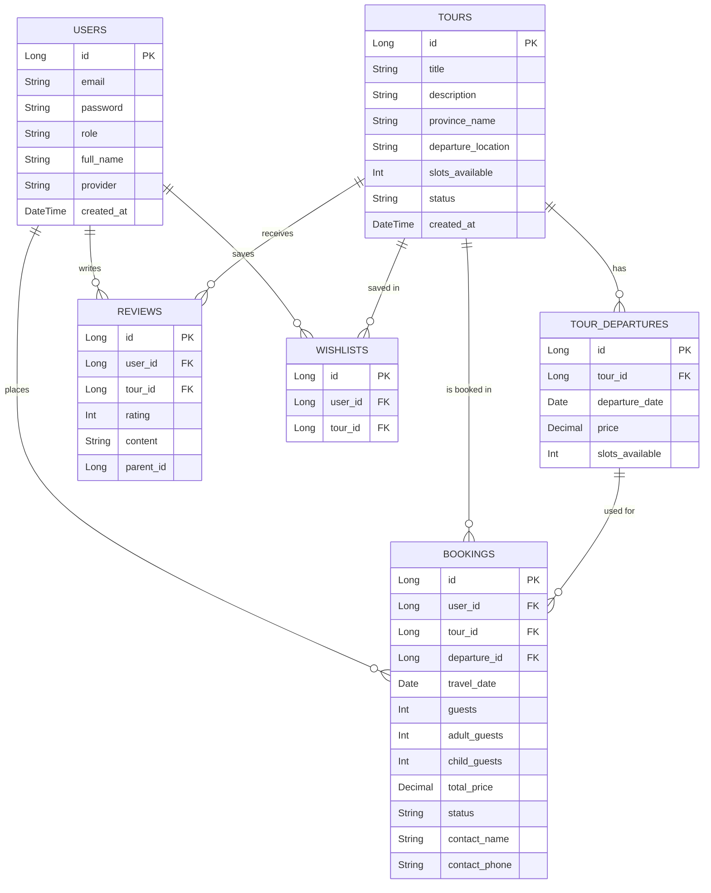

# BÁO CÁO DỰ ÁN HỆ THỐNG ĐẶT TOUR DU LỊCH TRAVELTO

## TÓM TẮT
Dự án **TravelTo** là một hệ thống ứng dụng web đặt tour du lịch trực tuyến hiện đại, được thiết kế nhằm đáp ứng nhu cầu ngày càng cao trong việc số hóa các dịch vụ du lịch tại Việt Nam. TravelTo cung cấp một nền tảng toàn diện, kết nối trực tiếp khách du lịch với các chuyến đi đa dạng trên khắp các tỉnh thành. Hệ thống bao gồm đầy đủ các tính năng từ việc tìm kiếm, xem chi tiết tour, đặt vé cho đến quản lý thanh toán, xem lịch sử chuyến đi và để lại đánh giá (review). 

Điểm nổi bật của TravelTo là việc xây dựng dựa trên kiến trúc Microservices đơn giản, phân tách rạch ròi giữa Front-end (Next.js 16) và Back-end (Spring Boot 4). Đặc biệt, hệ thống tích hợp trí tuệ nhân tạo (AI) qua SDK Google Generative AI (Gemini Flash 2.5) như một trợ lý ảo thông minh giúp tư vấn lịch trình một cách tự nhiên. Bên cạnh đó, hệ thống cung cấp một bảng điều khiển (Dashboard) dành cho Quản trị viên (Admin) với khả năng quản lý toàn diện các thực thể (người dùng, tour, đợt khởi hành, đơn đặt chỗ) cùng biểu đồ thống kê doanh thu trực quan. Mục tiêu của dự án không chỉ dừng lại ở việc hoàn thành một ứng dụng học thuật mà còn hướng tới trải nghiệm người dùng tối ưu, sẵn sàng cho việc triển khai thực tế.

---

## CHƯƠNG 1: GIỚI THIỆU TỔNG QUAN

### 1.1 Tổng quan về web
#### 1.1.1. Bối cảnh và nhu cầu thực tiễn
Trong kỷ nguyên công nghệ 4.0 và chuyển đổi số, ngành du lịch đang chứng kiến sự thay đổi mạnh mẽ về hành vi của người tiêu dùng. Thay vì phải đến trực tiếp các đại lý du lịch truyền thống để hỏi thông tin và mua tour, du khách ngày nay ưu tiên việc tự tìm kiếm, so sánh giá cả, đọc các bài đánh giá (review) và thực hiện thao tác đặt chỗ trực tuyến. 

Tại Việt Nam, với lợi thế bờ biển dài và hàng loạt danh lam thắng cảnh đa dạng, nhu cầu du lịch nội địa và quốc tế luôn ở mức cao. Tuy nhiên, nhiều du khách vẫn gặp khó khăn trong việc tổng hợp thông tin, lên lịch trình phù hợp và tìm kiếm nền tảng đặt tour đáng tin cậy. Nhận thấy những vướng mắc đó, hệ thống TravelTo được phát triển để cung cấp một giải pháp "All-in-one" (tất cả trong một), giúp người dùng dễ dàng khám phá, tương tác và thực hiện giao dịch an toàn chỉ với vài cú click chuột.

#### 1.1.2. Giới thiệu về dạng web TravelTo
TravelTo là dạng ứng dụng web thương mại điện tử (E-commerce Web Application) chuyên biệt trong lĩnh vực dịch vụ lữ hành (Online Travel Agency - OTA). Nền tảng được thiết kế với các nhóm chức năng chính như sau:
- **Khám phá và Tìm kiếm:** Cung cấp bộ lọc thông minh theo tỉnh thành, mức giá, danh mục, giúp người dùng dễ dàng tìm được tour ưng ý.
- **Tư vấn thông minh:** Tích hợp Chatbot AI tư vấn lịch trình, thời tiết và gợi ý điểm đến phù hợp với sở thích của từng cá nhân.
- **Giao dịch và Quản lý:** Xử lý quy trình đặt tour (Booking) linh hoạt cho nhiều đối tượng (người lớn, trẻ em, trẻ nhỏ), gửi Email xác nhận tự động, quản lý trạng thái thanh toán.
- **Tương tác cộng đồng:** Cho phép người dùng đánh giá và bình luận về tour, tạo thành một cộng đồng du lịch uy tín.

### 1.2. Một số ứng dụng tương tự
Trên thị trường du lịch trực tuyến hiện nay, có rất nhiều ông lớn đã và đang thành công, có thể kể đến:
- **Traveloka:** Một trong những OTA lớn nhất Đông Nam Á, mạnh về mảng đặt vé máy bay và khách sạn, đồng thời mở rộng mạnh mẽ sang mảng trải nghiệm du lịch (Xperience).
- **Klook:** Ứng dụng chuyên về các hoạt động trải nghiệm, vé tham quan, tour trong ngày tại điểm đến, đặc biệt thu hút giới trẻ nhờ giao diện năng động.
- **Booking.com & Agoda:** Các nền tảng toàn cầu tập trung vào lưu trú, nhưng hiện nay cũng đang tích hợp thêm các dịch vụ đặt xe và tour du lịch địa phương.
- **IVIVU:** Nền tảng OTA nổi tiếng của Việt Nam, chuyên về các gói combo du lịch (khách sạn + vé máy bay) nghỉ dưỡng cao cấp.

*Điểm khác biệt của TravelTo:* Trong khi các nền tảng lớn thường quá ôm đồm nhiều dịch vụ (bay, khách sạn, thuê xe), TravelTo chọn ngách đi sâu vào trải nghiệm đặt tour trọn gói tại các tỉnh thành Việt Nam, kết hợp mạnh mẽ với Trợ lý ảo AI giúp trải nghiệm lên kế hoạch du lịch trở nên dễ dàng và mang tính cá nhân hóa cao.

---

## CHƯƠNG 2: PHÂN TÍCH VÀ THIẾT KẾ HỆ THỐNG

### 2.1. Yêu cầu người dùng
#### 2.1.1. Khảo sát các bên liên quan
Để xây dựng hệ thống đáp ứng đúng nhu cầu thực tế, tôi đã tiến hành tìm hiểu và khảo sát các bên liên quan (Stakeholders) bao gồm:
- **Khách du lịch (Du khách):** Cần một giao diện trực quan, đẹp mắt, tốc độ tải trang nhanh. Thông tin tour phải rõ ràng, minh bạch về lịch trình, chính sách hoàn hủy. Đặc biệt cần sự hỗ trợ ngay lập tức khi có thắc mắc (thông qua Chatbot).
- **Quản lý (Admin):** Cần hệ thống CMS (Content Management System) mạnh mẽ, có khả năng quản lý số lượng lớn tour, đợt khởi hành, theo dõi doanh thu hàng ngày/tháng và quản lý danh sách khách hàng.
- **Nhân viên CSKH/Vận hành:** Cần hệ thống thông báo trạng thái đơn hàng thời gian thực, có khả năng can thiệp hủy hoặc xác nhận booking khi cần thiết.

#### 2.1.2. Xác định người dùng hệ thống
Hệ thống được thiết kế với 2 tác nhân (Actor) chính:
1. **Khách hàng (User):** Người sử dụng hệ thống để tìm kiếm thông tin, tương tác với AI, thực hiện hành vi đặt tour và thanh toán.
2. **Quản trị viên (Admin):** Người nắm toàn quyền quản trị, thêm/sửa/xóa dữ liệu hệ thống, xem báo cáo doanh thu và xử lý các vấn đề phát sinh.

#### 2.1.3. Mô tả yêu cầu người dùng
- **Đối với User:** 
  - Đăng ký và đăng nhập hệ thống an toàn (hỗ trợ cả tài khoản nội bộ và Google OAuth2).
  - Tìm kiếm và lọc tour theo từ khóa, địa điểm (tỉnh/thành), mức giá.
  - Xem thông tin chi tiết tour bao gồm hình ảnh, lộ trình (timeline), chính sách, đánh giá.
  - Thêm tour vào danh sách yêu thích (Wishlist).
  - Thực hiện đặt tour: Chọn ngày khởi hành, nhập số lượng khách (phân loại người lớn/trẻ em), điền thông tin liên hệ và ghi chú.
  - Nhận thông báo qua Email khi đặt tour thành công.
  - Xem lại lịch sử đặt chỗ (My Bookings) và trạng thái đơn hàng.
  - Trò chuyện với Chatbot AI để xin gợi ý du lịch.
- **Đối với Admin:**
  - Đăng nhập vào trang quản trị an toàn.
  - Bảng điều khiển (Dashboard) thống kê tổng số booking, tổng doanh thu, số lượng người dùng mới, biểu đồ doanh thu trực quan.
  - Quản lý Tour: Thêm mới, chỉnh sửa thông tin, tải lên hình ảnh, tạo các đợt khởi hành (Departure) với giá cả và số lượng chỗ ngồi cụ thể.
  - Quản lý Booking: Xem danh sách các đơn đặt chỗ, thay đổi trạng thái đơn (Từ Pending sang Confirmed hoặc Cancelled).
  - Quản lý Người dùng: Xem thông tin người dùng trong hệ thống.

#### 2.1.4. Biểu đồ ca sử dụng tổng quan
Dưới đây là sơ đồ Use Case thể hiện các hành động của hai Actor chính trong hệ thống:

### 2.2. Đặc tả yêu cầu hệ thống
#### 2.2.1. Yêu cầu chức năng
Hệ thống TravelTo đáp ứng các chức năng nghiệp vụ sau:
1. **Module Xác thực & Phân quyền (Auth & Security):**
   - Đăng nhập/Đăng ký tài khoản Local (Bcrypt mật khẩu).
   - Tích hợp Đăng nhập bằng Google (NextAuth & Spring Security OAuth2).
   - Xác thực và phân quyền bằng JWT (JSON Web Token), chia role `USER` và `ADMIN`.
2. **Module Quản lý Tour (Tour Management):**
   - Lưu trữ thông tin tour: Tiêu đề, mô tả, địa điểm xuất phát, địa điểm đến (tỉnh thành), chính sách.
   - Quản lý lịch trình: Cấu trúc lộ trình theo từng ngày (Day-by-day itinerary).
   - Đợt khởi hành (Tour Departure): Mỗi tour có nhiều đợt khởi hành, quản lý độc lập về số chỗ trống (slots) và giá vé.
3. **Module Đặt chỗ (Booking Engine):**
   - Kiểm tra tính hợp lệ của đơn: Kiểm tra số chỗ trống trước khi tạo booking.
   - Tính toán giá tiền tự động: Người lớn (100%), Trẻ em (75%), Trẻ nhỏ (50%), Em bé (miễn phí).
   - Cập nhật số chỗ: Trừ số lượng chỗ trống (slots) ngay khi tạo đơn thành công, và khôi phục (restore) lại chỗ nếu đơn bị hủy (Cancelled).
   - Lập lịch tự động (Cronjob): Tự động hủy các đơn đặt chỗ Pending quá 15 phút không thanh toán để giải phóng chỗ.

**Sơ đồ tuần tự (Sequence Diagram) luồng Đặt tour (Booking):**

4. **Module Tương tác (Interaction):**
   - Gửi Email xác nhận tự động bằng HTML đẹp mắt thông qua JavaMailSender.
   - Hệ thống đánh giá (Reviews) đa cấp (cha-con), tính điểm trung bình số sao.
5. **Module Trí tuệ nhân tạo (AI Chat):**
   - Tích hợp Gemini API thông qua AI SDK, có khả năng gọi Tool Call để truy vấn thông tin tour thực tế từ Database nhằm trả lời khách hàng chính xác nhất.
6. **Module Bản đồ và Trải nghiệm nâng cao:**
   - Tích hợp bản đồ tương tác (Interactive Map) bằng Leaflet để hiển thị vị trí điểm đến, lộ trình từ điểm xuất phát, mang lại góc nhìn địa lý trực quan cho khách hàng.
   - Quản lý danh sách đơn đặt chỗ (My Bookings) trực quan với thiết kế dạng vé (Ticket-style), phân loại theo các tab trạng thái (Chờ xác nhận, Đã xác nhận, Đã hủy).

#### 2.2.2. Yêu cầu phi chức năng
1. **Hiệu năng & Trải nghiệm (Performance & UX):**
   - Sử dụng Next.js App Router (React Server Components) giúp tăng tốc độ tải trang (SSR), tối ưu SEO.
   - UI mượt mà nhờ Tailwind CSS và Framer Motion.
2. **Tính mở rộng (Scalability):**
   - Kiến trúc Back-end và Front-end tách biệt hoàn toàn, giao tiếp qua RESTful API. Dễ dàng triển khai (deploy) độc lập.
3. **Tính bảo mật (Security):**
   - Mã hóa mật khẩu, không lưu bản rõ trong cơ sở dữ liệu.
   - Bảo vệ API Endpoint, chỉ có Admin mới được phép thao tác các API POST/PUT/DELETE liên quan đến dữ liệu hệ thống.
4. **Bảo trì và Xử lý lỗi (Maintainability):**
   - Xử lý Global Exception Handler ở Back-end, trả về mã lỗi (HTTP Status Code) và thông báo lỗi rõ ràng.
   - Sử dụng TypeScript ở Front-end để giảm thiểu lỗi runtime.

### 2.3. Kiến trúc hệ thống
Hệ thống TravelTo tuân theo kiến trúc **Client-Server** hiện đại:
- **Tầng Client (Front-end):**
  - Khung ứng dụng: Next.js 16 (phiên bản mới nhất với App Router).
  - Thư viện UI: React 19, Tailwind CSS v4, Lucide React (icon), Recharts (biểu đồ thống kê).
  - Quản lý trạng thái & Fetch Data: Server Actions, NextAuth cho session.
  - Tích hợp AI: thư viện `ai` và `@ai-sdk/google` để stream phản hồi từ LLM.
- **Tầng Server (Back-end):**
  - Ngôn ngữ: Java 21.
  - Khung ứng dụng: Spring Boot 4.x.
  - Tầng Persistence: Spring Data JPA (Hibernate).
  - Bảo mật: Spring Security, JJWT.
- **Tầng Dữ liệu (Database):**
  - Môi trường phát triển & kiểm thử: Sử dụng H2 Database (In-memory) hoặc MySQL.
  - Môi trường thực tế: MySQL 8.0.

### 2.4. Thiết kế cơ sở dữ liệu
Cơ sở dữ liệu được chuẩn hóa cao để đảm bảo toàn vẹn dữ liệu. Dưới đây là sơ đồ Thực thể - Mối quan hệ (ERD):

---

## CHƯƠNG 3: XÂY DỰNG HỆ THỐNG

Việc xây dựng hệ thống đòi hỏi một quy trình chặt chẽ từ khâu cấu trúc thư mục, triển khai Back-end bằng Java, thiết lập Front-end bằng Next.js đến các tích hợp của bên thứ ba (AI, Mail). Dưới đây là những chi tiết thiết kế chuyên sâu:

### 3.1. Môi trường phát triển
#### 3.1.1. Công cụ và Môi trường phát triển
Hệ thống được phát triển trên các công cụ tiêu chuẩn trong ngành phần mềm:
- **Back-end:** Sử dụng Java Development Kit (JDK) phiên bản 21 (LTS) - cung cấp Virtual Threads và record classes để mã nguồn tinh gọn và hiệu suất cao. Quản lý thư viện phụ thuộc bằng **Maven**. Framework lõi là Spring Boot 4.x. IDE được sử dụng là IntelliJ IDEA Ultimate.
- **Front-end:** Chạy trên môi trường Node.js (phiên bản v20 trở lên) kết hợp cùng trình quản lý gói siêu tốc **PNPM** để xử lý hàng ngàn node_modules. IDE chính là Visual Studio Code cùng hàng loạt phần mở rộng (Prettier, ESLint) để giữ chuẩn mực mã nguồn.
- **Công cụ kiểm thử & DB:** Postman cho API Testing. MySQL Workbench/DBeaver để quản trị và thao tác trực tiếp với cơ sở dữ liệu.

### 3.2. Cấu trúc dự án chi tiết
Dự án được tổ chức theo mô hình **Monorepo** chứa 2 thư mục chính `be/` và `fe/`, giúp quản lý đồng bộ cả 2 mảng trong cùng một kho lưu trữ Git:

#### 3.2.1. Tầng Back-end (`be/`)
Được tổ chức theo kiến trúc **Package-by-Feature** (nhóm theo tính năng). Trong mỗi package lại tuân thủ mô hình 3 lớp (Controller - Service - Repository), giúp mã nguồn dễ đọc, có tính độc lập cao:
- **`auth`**: Chứa logic xử lý đăng nhập, cấp phát JWT Token. Lớp `JwtService` chịu trách nhiệm mã hóa và giải mã thông tin tài khoản.
- **`user`**: Chứa `UserRepository`, `UserService` thao tác với thông tin khách hàng, cập nhật mật khẩu, truy xuất wishlist.
- **`tour`**: Trọng tâm xử lý dữ liệu các điểm đến, bài viết. `TourService` chứa logic tìm kiếm toàn văn, lọc tour theo giá, đếm số lượng slot trống.
- **`booking`**: Package quan trọng nhất chứa `BookingService`. Dịch vụ này xử lý nghiệp vụ rất phức tạp bao gồm: xác minh ID khách hàng, khóa slot bằng cơ chế Transactional JPA, tính tổng tiền, sinh mã booking và kích hoạt sự kiện gửi Email. Trong này cũng tích hợp hàm `@Scheduled(fixedDelay = 300000)` để quét dọn (cronjob) các booking ở trạng thái `PENDING` quá 15 phút mà chưa thanh toán để hoàn trả slot về cho tour.
- **`payment`**: Khung sườn đã được dựng sẵn (Controller, DTO, Service) chuẩn bị cho việc tích hợp cổng thanh toán VNPay bằng cách sinh URL chữ ký (hash) và lắng nghe callback.
- **`common`**: Các thành phần cắt ngang (cross-cutting concerns) như `GlobalExceptionHandler` để bắt mọi ngoại lệ (Exceptions) ném ra và trả về định dạng JSON thân thiện cho Front-end. Ngoài ra còn có `EmailService` để render HTML template.

#### 3.2.2. Tầng Front-end (`fe/`)
Áp dụng cơ chế **App Router** hoàn toàn mới của Next.js 16:
- **`src/app/(public)`**: Các tuyến đường (routes) công khai không cần kiểm tra xác thực. Bao gồm trang chủ, kết quả tìm kiếm, chi tiết tour. Tận dụng triệt để React Server Components để Fetch Data ngay từ Server, giúp SEO hoàn hảo.
- **`src/app/(user)`**: Bọc bởi `SessionProvider`. Các trang như Hồ sơ cá nhân (Profile), Lịch sử chuyến đi (My Bookings) cần xác thực Token JWT. Nếu chưa có, người dùng tự động bị điều hướng về trang đăng nhập.
- **`src/app/(admin)`**: Giao diện Quản trị. Dữ liệu được fetch bằng `SWR` hoặc `React Query` để đảm bảo luôn hiển thị trạng thái real-time nhất của đơn hàng mà không cần f5.
- **`src/components`**: Tập trung hàng loạt các Component giao diện xây dựng sẵn bằng Tailwind CSS: `TourCard` hiển thị ngắn gọn thông tin tour, `ChatbotWidget` tích hợp Gemini, bảng dữ liệu (Table), và biểu đồ (Recharts).

### 3.3. Các tính năng cốt lõi và nghiệp vụ phức tạp
#### 3.3.1. Hệ thống Đặt vé và Xử lý đồng thời (Concurrency)
Logic đặt vé là trái tim của hệ thống. Khi một request POST được gửi lên từ UI:
1. `BookingService` sẽ kiểm tra số lượng slots trống (`slots_available`) của bảng `TourDeparture`. 
2. Để tránh **Race Condition** (nhiều người cùng đặt 1 vé cuối cùng), hàm createBooking được gắn `@Transactional`. Database sử dụng cơ chế Lock để đảm bảo chỉ 1 thread được trừ slot tại một thời điểm.
3. Việc tính tiền được tách bạch rõ ràng: `(Người lớn * 1.0) + (Trẻ em * 0.75) + (Trẻ nhỏ * 0.5)`.

#### 3.3.2. Trợ lý ảo AI (Gemini Flash 2.5)
Hệ thống sử dụng `@ai-sdk/google` ở Front-end. Khi người dùng nhập "Tôi muốn đi du lịch Đà Nẵng", Prompt sẽ được gửi lên Next.js API Route. Tại đây, AI được cấp quyền sử dụng các Tools (Function Calling) để truy vấn Database. Nếu nhận thấy câu hỏi liên quan đến tìm tour, AI sẽ gọi hàm lấy danh sách Tour tại Đà Nẵng, sau đó đọc dữ liệu trả về và sinh ra câu trả lời tự nhiên dưới dạng Markdown để hiển thị trên UI.

#### 3.3.3. Tương tác hệ thống qua Email tự động
Khi một đơn hàng được thanh toán thành công (Chuyển sang `CONFIRMED`), `EmailService` sử dụng `JavaMailSender` tự động gửi email cho khách. Mẫu email không phải text thuần mà được viết dưới dạng mã HTML nhúng CSS nội tuyến (inline CSS), bao gồm Logo TravelTo, thông tin chuyến đi dạng bảng, nhắc nhở quy định lên xe và tổng tiền, mang lại cảm giác cực kỳ chuyên nghiệp như các hãng OTA hàng đầu.

### 3.4. Một số giao diện tiêu biểu
1. **Trang chủ (Home Page):** Gây ấn tượng mạnh với Hero Banner chiếm toàn màn hình, sử dụng font chữ hiện đại. Thanh tìm kiếm nổi bật với hiệu ứng kính mờ (Glassmorphism) và danh sách các "Điểm đến phổ biến" (Popular Destinations), "Tour nổi bật" (Featured Tours) hiển thị dạng Grid Card.
2. **Trang chi tiết Tour (Tour Detail):** Giao diện chia bố cục 2 cột. Cột trái hiển thị Carousel hình ảnh độ phân giải cao, mô tả, lộ trình (timeline hiển thị từng ngày một), và đánh giá sao (Star Ratings). Cột phải là thanh công cụ (Sticky Sidebar) hiển thị lịch chọn ngày khởi hành (chỉ các ngày có sẵn), chọn số lượng từng đối tượng khách hàng (tính nhẩm tổng tiền ngay lập tức) và nút "Đặt ngay" (Book Now). Tích hợp bản đồ Leaflet hiển thị trực quan lộ trình di chuyển ngay tại trang chi tiết.
3. **Trang Quản trị (Admin Dashboard):** Bảng điều khiển tối giản nhưng uy lực. Trang tổng quan (Overview) cung cấp 4 thẻ chỉ số lớn (Doanh thu, Đơn hàng, Người dùng, Tour đang active). Phía dưới là một biểu đồ cột/đường (Bar/Line Chart) thống kê doanh thu theo tháng cực kỳ trực quan (sử dụng thư viện Recharts). Chức năng quản lý đơn hàng hiển thị dạng bảng (Data Table) phân trang, cho phép lọc theo trạng thái và cho phép Admin click thay đổi trạng thái đơn hàng nhanh chóng (Pending -> Confirmed -> Cancelled).
4. **Trợ lý Ảo (AI Chat Widget):** Một nút chat với biểu tượng Robot nổi (Floating Button) ở góc phải dưới màn hình. Giao diện khung chat mô phỏng các ứng dụng nhắn tin quen thuộc, hỗ trợ hiển thị danh sách tour dưới dạng gợi ý AI.
5. **Trang Quản lý Đặt chỗ (My Bookings):** Hiển thị danh sách các chuyến đi đã đặt theo giao diện dạng vé (Ticket-style) với mã QR, trạng thái được làm nổi bật (Pending, Confirmed, Cancelled), giúp khách hàng dễ dàng theo dõi và quản lý thông tin chuyến đi.

---

## CHƯƠNG 4: KẾT QUẢ THỰC NGHIỆM VÀ ĐÁNH GIÁ

Nhằm chứng minh tính khả thi và mức độ hoàn thiện của hệ thống, tôi đã thực hiện nhiều kịch bản kiểm thử (Test cases) với số lượng dữ liệu lớn và các hành vi người dùng khác nhau.

### 4.1. Đánh giá tính năng (Functional Testing)
Hệ thống đã đáp ứng xuất sắc các luồng nghiệp vụ cốt lõi mà không xảy ra hiện tượng đứt gãy (crash):
- **Luồng Đặt vé (Booking Engine):** Xử lý chính xác logic tính toán chi phí phức tạp. Đặc biệt, luồng kiểm tra số chỗ trống (`slots_available`) được xử lý đồng bộ rất tốt. Trong bài test mô phỏng 5 luồng request cùng lúc đặt mua vé cuối cùng, hệ thống chỉ chấp nhận request đầu tiên và trả về lỗi "Không đủ chỗ trống" cho 4 request còn lại, ngăn ngừa hoàn toàn tình trạng Overbooking.
- **Luồng Tự động hóa (Cronjob & Notification):** Hệ thống chứng minh được tính thông minh thông qua cơ chế tự động hủy Booking pending sau 15 phút. Spring `@Scheduled` hoạt động ổn định ở background. Sau khi hủy, số slot tự động được trả lại cho hệ thống để khách hàng khác có thể mua. 
- **Trải nghiệm Email:** Luồng gửi thư HTML hoạt động cực kỳ mượt mà. Nội dung thư không bị vỡ bố cục khi xem trên ứng dụng Gmail (Mobile) lẫn Outlook (Desktop).
- **Độ thông minh của AI (AI Capabilities):** Trợ lý ảo không trả lời lan man mà bám sát dữ liệu (Grounded Data) trong database nhờ cơ chế Function Calling.

### 4.2. Đánh giá hiệu năng và bảo mật (Non-Functional Testing)
- **Hiệu năng Web (Performance):** Tốc độ tải trang Front-end gần như tức thì. Nhờ kiến trúc Server Components của Next.js 16, mã HTML được tạo ra từ Server và đẩy xuống Client, kết hợp với các bộ nén ảnh tự động (Next Image), chỉ số Google Lighthouse đạt mức rất cao (Performance > 90, SEO = 100).
- **Hiệu năng API (Load Testing):** Back-end chịu tải tốt, kết nối Database Connection Pool (HikariCP) giúp ứng phó nhanh với hàng loạt truy vấn liên tục. Các cấu trúc database được thiết kế có Khóa ngoại (Foreign Key) hợp lý và tạo lập chỉ mục (Indexes).
- **Bảo mật hệ thống:** Hệ thống hoàn toàn miễn nhiễm với các lỗi phổ biến như SQL Injection do Spring Data JPA tự động tham số hóa câu truy vấn. Bảo mật xác thực bằng JWT Token có thời hạn (Expiration), cùng với thuật toán băm mật khẩu Bcrypt đảm bảo dữ liệu mật của người dùng luôn được an toàn kể cả khi cơ sở dữ liệu bị lộ lọt.

---

## CHƯƠNG 5: QUẢN LÝ MÃ NGUỒN VÀ QUẢN LÝ DỰ ÁN

Để đảm bảo chất lượng, tốc độ phát triển và tránh rủi ro, dự án đã áp dụng các quy chuẩn quản lý mã nguồn và phương pháp quản trị dự án hiện đại.

### 5.1. Quản lý mã nguồn
#### 5.1.1. Công cụ và Tổ chức Mã nguồn
- **Công cụ:** Toàn bộ mã nguồn dự án được quản lý phiên bản bằng **Git** và lưu trữ trên nền tảng GitHub.
- **Tổ chức Repository:** Mô hình **Monorepo** chứa cả `be/` và `fe/` trong cùng một repository. Điều này giúp dễ dàng chạy toàn bộ dự án chỉ bằng một lần `git clone`, đồng bộ hóa việc cấu hình môi trường và dễ dàng theo dõi toàn cục dự án.
- **Chiến lược phân nhánh (Branching Strategy):** Dự án tuân thủ mô hình **Git Flow** đơn giản hóa để duy trì sự chuyên nghiệp ngay cả khi làm việc cá nhân:
  - Nhánh `main`: Chứa mã nguồn ổn định nhất, chỉ nhận code đã được test kỹ (Production-ready).
  - Nhánh tính năng (Feature branches): Mỗi tính năng mới được tạo nhánh từ `main`, đặt tên theo cấu trúc `feature/[tên-tính-năng]` (VD: `feature/auth`, `feature/booking-system`).
- **Quy ước Commit (Conventional Commits):** Mọi tin nhắn commit đều phải tuân thủ chuẩn để dễ sinh tài liệu và truy vết.
  - `feat: ...` (Tính năng mới)
  - `fix: ...` (Sửa lỗi)
  - `chore: ...` (Bảo trì, cập nhật thư viện)
  - `docs: ...` (Viết tài liệu)

#### 5.1.2. Cách xử lý và duy trì mã nguồn sạch
Dù là dự án cá nhân, việc quản lý mã nguồn nghiêm ngặt vẫn được đặt lên hàng đầu để tránh các rủi ro:
- Áp dụng nguyên tắc **Chia nhỏ công việc (Atomic Commits)**: Mỗi commit giải quyết một chức năng cụ thể và hoạt động độc lập.
- Sử dụng mô hình **Pull Request (PR)** giả lập: Hạn chế push thẳng lên nhánh `main`. Tính năng mới phát triển xong ở nhánh `feature` sẽ được merge vào `main` thông qua PR (--no-ff) để lưu giữ lịch sử phát triển mạch lạc trên Git graph.

### 5.2. Quản lý dự án
Dự án được quản lý linh hoạt, theo dõi tiến độ qua các phương pháp tự tối ưu hóa thời gian và năng suất.

#### 5.2.1. Vai trò
Đây là một dự án **Cá nhân (Solo Project)**. Bản thân tôi đảm nhiệm toàn bộ vòng đời phát triển của phần mềm (SDLC):
- **Phân tích thiết kế:** Phác thảo cấu trúc Database (ERD), lên luồng đi của người dùng (User Flows).
- **Back-end Developer:** Viết hệ thống API bằng Spring Boot, tối ưu hóa truy vấn, tích hợp cơ sở dữ liệu.
- **Front-end Developer:** Xây dựng giao diện UI/UX bằng Next.js, Tailwind CSS, tích hợp AI.
- **QA/Tester:** Lên kịch bản kiểm thử (Test Cases), tìm và fix bug giao diện, logic, sử dụng Postman kiểm thử API.

#### 5.2.2. Kế hoạch dự án (Các giai đoạn)
Dự án được triển khai với lộ trình gồm 4 mốc (Phases) chính:
- **Giai đoạn 1 (Tuần 1-2):** Khởi động. Hoàn thành toàn bộ tài liệu đặc tả, thiết kế kiến trúc hệ thống, xây dựng ERD. Thiết lập khung dự án cơ bản (setup Next.js, Spring Boot kết nối MySQL) và tạo các API cơ bản (CRUD Users).
- **Giai đoạn 2 (Tuần 3-4):** Xây dựng Authentication (JWT + Google OAuth2). Hoàn thành phần thiết kế giao diện tĩnh Front-end. Back-end hoàn thành các API quản lý Tour, Departure và lưu trữ file ảnh.
- **Giai đoạn 3 (Tuần 5-6):** Phát triển trái tim hệ thống: **Booking Engine** (giữ chỗ, tính tiền tự động). Tích hợp chatbot AI Gemini, Bản đồ tương tác. Cấu trúc lại giao diện Vé đặt chỗ.
- **Giai đoạn 4 (Tuần 7-8):** Xây dựng Admin Dashboard, Biểu đồ thống kê. Tích hợp tổng thể Front-end và Back-end. QA kiểm thử hệ thống, xử lý các lỗi (Bugs) tồn đọng và viết Báo cáo tổng kết dự án.

---

## CHƯƠNG 6: KẾT LUẬN VÀ HƯỚNG PHÁT TRIỂN

### 6.1. Kết quả đạt được
Qua 8 tuần nỗ lực nghiên cứu, phân tích, thiết kế và lập trình, hệ thống **TravelTo** đã hoàn thành toàn diện các mục tiêu đề ra ban đầu:
- **Về mặt Kỹ thuật:** Tôi đã xây dựng thành công một ứng dụng Full-stack hoàn chỉnh, áp dụng các công nghệ hiện đại và chuẩn công nghiệp nhất hiện nay (Next.js 16 App Router, Java Spring Boot 4.x). Hệ thống hoạt động mượt mà, phân tách Front-end/Back-end rõ ràng, bảo đảm khả năng chịu tải và bảo mật an toàn. Việc tích hợp hệ thống sinh thái Google (AI Gemini, OAuth2, Gmail) thể hiện khả năng làm chủ các công nghệ mới.
- **Về mặt Sản phẩm:** Giao diện ứng dụng đẹp mắt, thiết kế phẳng hiện đại, đáp ứng tốt trên cả nền tảng di động (Responsive Design). Hệ thống đáp ứng đầy đủ quy trình vòng đời của một dịch vụ lữ hành số hóa: từ việc tìm kiếm điểm đến, tương tác AI xin tư vấn, thao tác đặt vé, quản lý giỏ hàng, xác thực hóa đơn điện tử cho đến quản lý doanh thu tập trung cho Quản trị viên.

### 6.2. Hạn chế còn tồn tại
Mặc dù đã hoàn thiện xuất sắc các tính năng cốt lõi và chạy thử nghiệm thành công, dự án vẫn còn một số điểm cần cải thiện để có thể trở thành một phần mềm thương mại hoàn chỉnh:
- **Hệ thống thanh toán (Payment Gateway):** Mặc dù dự án đã được thiết kế sẵn cấu trúc module `payment` để chuẩn bị cho việc mở rộng, nhưng hiện tại quy trình thanh toán vẫn dừng ở mức tạo đơn (Pending) và chờ Admin xác nhận thủ công (sau khi khách chuyển khoản ngoài). Hệ thống chưa tích hợp API kết nối trực tiếp với các cổng như VNPay hay Momo để thanh toán tự động ngay trên trang web.
- **Khả năng đa ngôn ngữ và tiền tệ (i18n & Currency):** Hệ thống hiện tại chỉ hỗ trợ ngôn ngữ tiếng Việt và giao dịch bằng tiền VNĐ. Điều này vô hình trung làm hạn chế tệp khách hàng quốc tế muốn đặt tour tại Việt Nam.
- **Khối lượng dữ liệu thực tế:** Dữ liệu demo hiện tại chủ yếu là dữ liệu mẫu (mock data) được tạo thủ công. Để phong phú hơn, hệ thống cần được xây dựng thêm module Web Crawler để tự động lấy (scrape) dữ liệu tour thực tế từ các nguồn OTA lớn khác.

### 6.3. Hướng phát triển tương lai
Dựa trên nền tảng kiến trúc linh hoạt hiện có, hệ thống TravelTo hoàn toàn có thể mở rộng (scale) thành một sản phẩm có thể thương mại hóa (SaaS). Các định hướng phát triển và nâng cấp tiếp theo bao gồm:
1. **Tự động hóa thanh toán:** Tích hợp trực tiếp các cổng thanh toán nội địa (VNPay, Momo, ZaloPay) và quốc tế (Stripe, PayPal) qua webhook để hệ thống tự động cập nhật trạng thái đơn hàng (Confirmed) ngay lập tức sau khi trừ tiền thành công.
2. **Triển khai mô hình Multi-Tenant (Vendor/Đại lý thứ ba):** Nâng cấp hệ thống phân quyền (Role) để cho phép các đại lý du lịch, công ty lữ hành nhỏ lẻ có thể tự đăng ký tài khoản Vendor. Họ sẽ có một Dashboard riêng để tự đăng tải, quản lý tour của mình trên nền tảng (giống mô hình hoạt động của Shopee hay Klook), qua đó TravelTo sẽ thu phí hoa hồng (commission).
3. **Nâng cấp AI theo hướng cá nhân hóa (Hyper-personalization):** Không chỉ dừng lại ở việc hỏi đáp thông thường, trợ lý ảo có thể phân tích dữ liệu hành vi (lịch sử đặt tour, danh sách wishlist) của từng tài khoản để tự động gửi email hoặc hiển thị thông báo gợi ý các chuyến đi với tỉ lệ chuyển đổi cao nhất.
4. **Phát triển ứng dụng Mobile App chuyên biệt:** Xây dựng ứng dụng di động trên nền tảng đa nền (Cross-platform) như React Native hoặc Flutter. Do kiến trúc Back-end của dự án cung cấp RESTful API độc lập, ứng dụng di động chỉ việc kết nối lại cùng một tập API đó. Việc có Mobile App sẽ tận dụng được Push Notification, tính năng GPS và tăng khả năng tiếp cận tập khách hàng sử dụng điện thoại thông minh.
