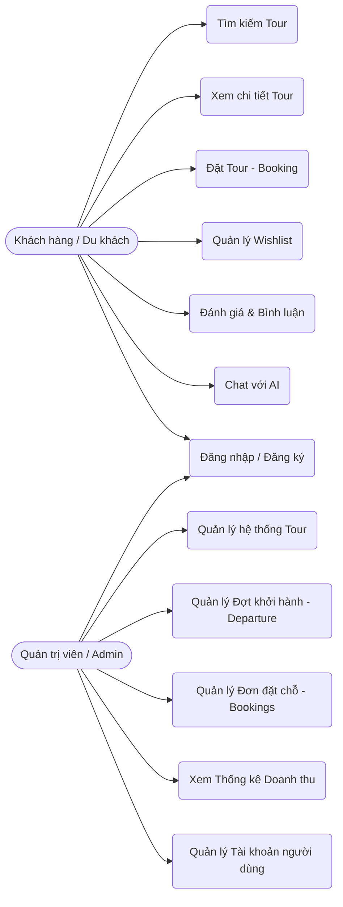
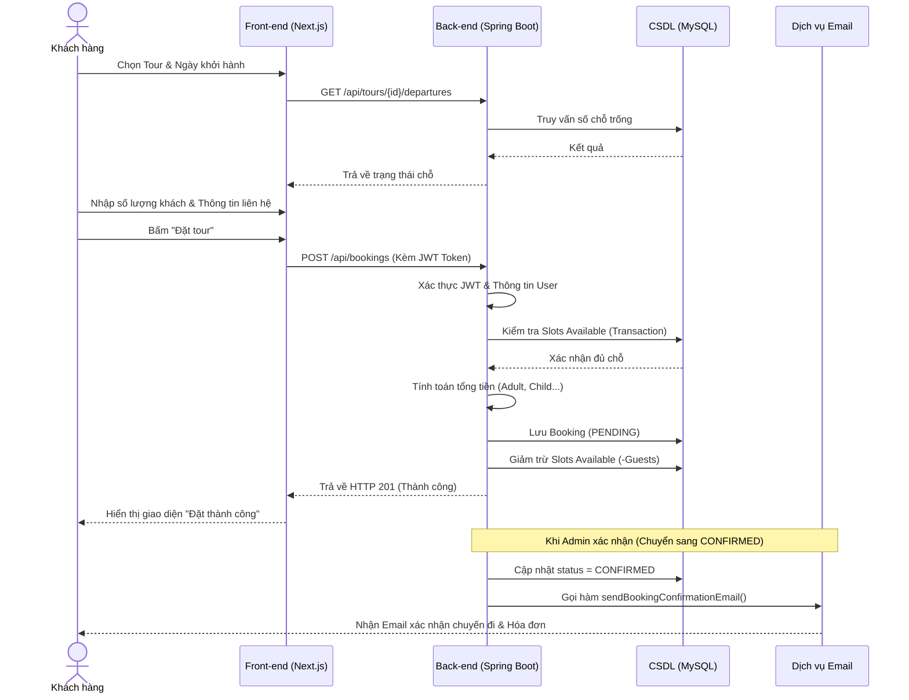
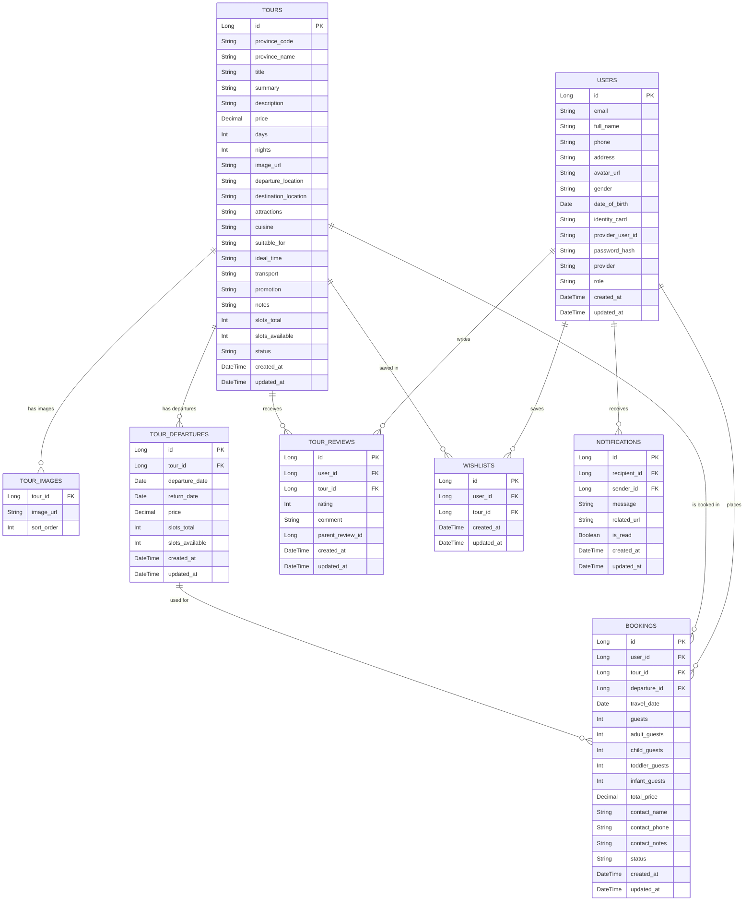

**TRƯỜNG ĐẠI HỌC QUY NHƠN**

**KHOA CÔNG NGHỆ THÔNG TIN**

![][image1]

**BÁO CÁO ĐỀ TÀI**

**HỌC PHẦN: THỰC HÀNH CÔNG NGHỆ PHẦN MỀM**

WEBSITE ĐẶT TOUR DU LỊCH TRAVELTO

    Sinh viên thực hiện: Lê Nhật Trường

    MSV: 4551050239

    Lớp: Công nghệ thông tin K45C

    Ngành: Công nghệ thông tin

    Giảng viên hướng dẫn: Trần Hoàng Việt

    		GIA LAI, 2026

# **TÓM TẮT** {#tóm-tắt}

TravelTo là hệ thống đặt tour du lịch trực tuyến được xây dựng nhằm đáp ứng xu hướng chuyển đổi số trong lĩnh vực du lịch tại Việt Nam. Nền tảng cho phép khách hàng dễ dàng tìm kiếm, khám phá và đặt các tour du lịch đến nhiều địa điểm khác nhau trên cả nước thông qua một giao diện trực quan và thuận tiện.

Hệ thống cung cấp đầy đủ các chức năng cần thiết cho quá trình đặt tour, bao gồm tìm kiếm tour, xem thông tin chi tiết, lựa chọn lịch khởi hành, thực hiện đặt chỗ, thanh toán trực tuyến, theo dõi lịch sử giao dịch và đánh giá trải nghiệm sau chuyến đi. Nhờ đó, người dùng có thể quản lý toàn bộ hành trình của mình trên một nền tảng thống nhất.

Về mặt kỹ thuật, TravelTo được phát triển theo mô hình Client–Server với sự tách biệt rõ ràng giữa giao diện người dùng và hệ thống xử lý nghiệp vụ. Phần Front-end được xây dựng bằng Next.js 16, trong khi Back-end sử dụng Spring Boot 4 để đảm bảo khả năng mở rộng, bảo trì và phát triển lâu dài.

Một trong những điểm nổi bật của dự án là việc tích hợp trí tuệ nhân tạo thông qua Google Generative AI SDK (Gemini Flash 2.5). Trợ lý AI có khả năng hỗ trợ tư vấn lịch trình, gợi ý điểm đến và tương tác với người dùng bằng ngôn ngữ tự nhiên, góp phần nâng cao trải nghiệm sử dụng hệ thống.

Ngoài các chức năng dành cho khách hàng, TravelTo còn cung cấp bảng điều khiển quản trị giúp quản lý người dùng, tour du lịch, đợt khởi hành và đơn đặt chỗ một cách hiệu quả. Hệ thống cũng hỗ trợ các biểu đồ thống kê doanh thu trực quan, giúp quản trị viên dễ dàng theo dõi và đánh giá tình hình hoạt động.

Dự án hướng đến mục tiêu ứng dụng thực tế, tập trung vào trải nghiệm người dùng, tính ổn định và khả năng triển khai trong môi trường thực tế.

#

# **MỤC LỤC** {#mục-lục}

[**TÓM TẮT 2**](#tóm-tắt)

[**MỤC LỤC 3**](#mục-lục)

[**CHƯƠNG 1: GIỚI THIỆU TỔNG QUAN 5**](#chương-1:-giới-thiệu-tổng-quan)

[1.1 Tổng quan về website đặt tour du lịch TravelTo 5](#1.1-tổng-quan-về-website-đặt-tour-du-lịch-travelto)

[1.1.1 Bối cảnh và nhu cầu thực tiễn 5](#1.1.1-bối-cảnh-và-nhu-cầu-thực-tiễn)

[1.1.2. Giới thiệu về dạng web TravelTo 5](#1.1.2.-giới-thiệu-về-dạng-web-travelto)

[1.2. Một số ứng dụng tương tự 6](#1.2.-một-số-ứng-dụng-tương-tự)

[**CHƯƠNG 2: PHÂN TÍCH VÀ THIẾT KẾ HỆ THỐNG 7**](#chương-2:-phân-tích-và-thiết-kế-hệ-thống)

[2.1. Yêu cầu người dùng 7](#2.1.-yêu-cầu-người-dùng)

[2.1.1. Khảo sát các bên liên quan 7](#2.1.1.-khảo-sát-các-bên-liên-quan)

[2.1.2. Xác định người dùng hệ thống 7](#2.1.2.-xác-định-người-dùng-hệ-thống)

[2.1.3. Mô tả yêu cầu người dùng 7](#2.1.3.-mô-tả-yêu-cầu-người-dùng)

[2.1.4. Biểu đồ ca sử dụng tổng quan 9](#2.1.4.-biểu-đồ-ca-sử-dụng-tổng-quan)

[2.2. Đặc tả yêu cầu hệ thống 10](#2.2.-đặc-tả-yêu-cầu-hệ-thống)

[2.2.1. Yêu cầu chức năng 10](#2.2.1.-yêu-cầu-chức-năng)

[2.2.2. Yêu cầu phi chức năng 11](#2.2.2.-yêu-cầu-phi-chức-năng)

[2.3. Kiến trúc hệ thống 12](#2.3.-kiến-trúc-hệ-thống)

[2.4. Thiết kế cơ sở dữ liệu 13](#2.4.-thiết-kế-cơ-sở-dữ-liệu)

[**CHƯƠNG 3: XÂY DỰNG HỆ THỐNG 14**](#chương-3:-xây-dựng-hệ-thống)

[3.1. Môi trường phát triển 14](#3.1.-môi-trường-phát-triển)

[3.1.1. Công cụ và Môi trường phát triển 14](#3.1.1.-công-cụ-và-môi-trường-phát-triển)

[3.2. Cấu trúc dự án chi tiết 14](#3.2.-cấu-trúc-dự-án-chi-tiết)

[3.2.1. Tầng Back-end (be/) 14](<#3.2.1.-tầng-back-end-(be/)>)

[3.2.2. Tầng Front-end (fe/) 15](<#3.2.2.-tầng-front-end-(fe/)>)

[3.3. Các tính năng cốt lõi và nghiệp vụ phức tạp 16](#3.3.-các-tính-năng-cốt-lõi-và-nghiệp-vụ-phức-tạp)

[3.3.1. Hệ thống Đặt vé và Xử lý đồng thời (Concurrency) 16](<#3.3.1.-hệ-thống-đặt-vé-và-xử-lý-đồng-thời-(concurrency)>)

[3.3.2. Trợ lý ảo AI (Gemini Flash 2.5) 16](<#3.3.2.-trợ-lý-ảo-ai-(gemini-flash-2.5)>)

[3.3.3. Tương tác hệ thống qua Email tự động 16](#3.3.3.-tương-tác-hệ-thống-qua-email-tự-động)

[3.4. Một số giao diện tiêu biểu 17](#3.4.-một-số-giao-diện-tiêu-biểu)

[**CHƯƠNG 4: KẾT QUẢ THỰC NGHIỆM VÀ ĐÁNH GIÁ 19**](#chương-4:-kết-quả-thực-nghiệm-và-đánh-giá)

[4.1. Kế hoạch kiểm thử hệ thống 19](#4.1.-kế-hoạch-kiểm-thử-hệ-thống)

[4.1.1. Mục tiêu kiểm thử 19](#4.1.1.-mục-tiêu-kiểm-thử)

[4.1.2. Phạm vi kiểm thử 19](#4.1.2.-phạm-vi-kiểm-thử)

[4.1.3. Phương pháp kiểm thử 19](#4.1.3.-phương-pháp-kiểm-thử)

[4.1.4. Môi trường kiểm thử 20](#4.1.4.-môi-trường-kiểm-thử)

[4.2. Thiết kế test cases 21](#4.2.-thiết-kế-test-cases)

[**CHƯƠNG 5: QUẢN LÝ MÃ NGUỒN VÀ QUẢN LÝ DỰ ÁN 26**](#chương-5:-quản-lý-mã-nguồn-và-quản-lý-dự-án)

[5.1. Quản lý mã nguồn 26](#5.1.-quản-lý-mã-nguồn)

[5.1.1. Công cụ và Tổ chức Mã nguồn 26](#5.1.1.-công-cụ-và-tổ-chức-mã-nguồn)

[5.1.2. Cách xử lý và duy trì mã nguồn sạch 27](#5.1.2.-cách-xử-lý-và-duy-trì-mã-nguồn-sạch)

[5.2. Quản lý dự án 27](#5.2.-quản-lý-dự-án)

[5.2.1. Vai trò 27](#5.2.1.-vai-trò)

[5.2.2. Kế hoạch dự án (Các giai đoạn) 28](<#5.2.2.-kế-hoạch-dự-án-(các-giai-đoạn)>)

[**CHƯƠNG 6: KẾT LUẬN VÀ HƯỚNG PHÁT TRIỂN 29**](#chương-6:-kết-luận-và-hướng-phát-triển)

[6.1. Kết quả đạt được 29](#6.1.-kết-quả-đạt-được)

[6.2. Hạn chế còn tồn tại 29](#6.2.-hạn-chế-còn-tồn-tại)

[6.3. Hướng phát triển tương lai 30](#6.3.-hướng-phát-triển-tương-lai)

#

# **CHƯƠNG 1: GIỚI THIỆU TỔNG QUAN** {#chương-1:-giới-thiệu-tổng-quan}

## **1.1 Tổng quan về website đặt tour du lịch TravelTo** {#1.1-tổng-quan-về-website-đặt-tour-du-lịch-travelto}

## **1.1.1 Bối cảnh và nhu cầu thực tiễn** {#1.1.1-bối-cảnh-và-nhu-cầu-thực-tiễn}

Trong kỷ nguyên công nghệ 4.0 và chuyển đổi số, ngành du lịch đang chứng kiến sự thay đổi mạnh mẽ về hành vi của người tiêu dùng. Thay vì phải đến trực tiếp các đại lý du lịch truyền thống để hỏi thông tin và mua tour, du khách ngày nay ưu tiên việc tự tìm kiếm, so sánh giá cả, đọc các bài đánh giá và thực hiện thao tác đặt chỗ trực tuyến.

Tại Việt Nam, với lợi thế bờ biển dài và hàng loạt danh lam thắng cảnh đa dạng, nhu cầu du lịch nội địa và quốc tế luôn ở mức cao. Xuất phát từ thực tế đó, TravelTo được xây dựng với mục tiêu trở thành một nền tảng du lịch trực tuyến toàn diện, hỗ trợ người dùng trong toàn bộ quá trình từ tìm kiếm điểm đến, khám phá các tour du lịch, tham khảo đánh giá, nhận tư vấn lịch trình cho đến đặt chỗ và thanh toán trực tuyến. TravelTo hướng tới việc mang lại trải nghiệm thuận tiện, nhanh chóng và an toàn, giúp người dùng dễ dàng lên kế hoạch cho chuyến đi của mình chỉ với vài thao tác đơn giản.

## **1.1.2. Giới thiệu về dạng web TravelTo** {#1.1.2.-giới-thiệu-về-dạng-web-travelto}

TravelTo là một ứng dụng web thương mại điện tử trong lĩnh vực du lịch trực tuyến. Hệ thống đóng vai trò là cầu nối giữa khách hàng và các dịch vụ du lịch, cho phép người dùng tìm kiếm, đặt tour một cách thuận tiện trên nền tảng trực tuyến.

- Khám phá và Tìm kiếm: Cung cấp bộ lọc thông minh theo tỉnh thành, mức giá, danh mục, giúp người dùng dễ dàng tìm được tour ưng ý.
- Tư vấn thông minh: Tích hợp Chatbot AI tư vấn lịch trình, gợi ý điểm đến phù hợp với sở thích của từng cá nhân.
- Giao dịch và Quản lý: Xử lý quy trình đặt tour linh hoạt cho nhiều đối tượng (người lớn, trẻ em, trẻ nhỏ), gửi Email xác nhận tự động, quản lý trạng thái thanh toán.
- Tương tác cộng đồng: Cho phép người dùng đánh giá và bình luận về tour, tạo thành một cộng đồng du lịch uy tín.

## **1.2. Một số ứng dụng tương tự** {#1.2.-một-số-ứng-dụng-tương-tự}

Trên thị trường du lịch trực tuyến hiện nay, có rất nhiều ông lớn đã và đang thành công, có thể kể đến:

- Traveloka: Một trong những nền tảng du lịch trực tuyến phổ biến tại khu vực Đông Nam Á. Hệ thống cung cấp nhiều dịch vụ như đặt vé máy bay, khách sạn, xe đưa đón sân bay, vé tham quan và các hoạt động giải trí. Nhờ giao diện thân thiện cùng quy trình đặt chỗ đơn giản, Traveloka đã trở thành lựa chọn quen thuộc của nhiều khách du lịch.
- Klook: tập trung chủ yếu vào các hoạt động trải nghiệm, vé tham quan và các tour ngắn ngày tại nhiều điểm đến trên thế giới. Nền tảng này hướng đến đối tượng người dùng trẻ với giao diện hiện đại, khả năng tìm kiếm nhanh chóng và nhiều chương trình ưu đãi hấp dẫn.
- Booking.com & Agoda: Các nền tảng đặt phòng trực tuyến lớn nhất thế giới. Ngoài dịch vụ lưu trú, nền tảng này còn cung cấp các dịch vụ như đặt vé máy bay, thuê xe và đăng ký các hoạt động du lịch tại điểm đến. Điểm mạnh của Booking.com nằm ở số lượng đối tác lớn và hệ thống đánh giá minh bạch từ cộng đồng người dùng.
- IVIVU: Một trong những nền tảng du lịch trực tuyến nổi bật tại Việt Nam. Hệ thống tập trung vào các gói nghỉ dưỡng, combo khách sạn kết hợp vé máy bay và các tour du lịch trong nước. Với lợi thế am hiểu thị trường Việt Nam, IVIVU được nhiều người dùng lựa chọn khi tìm kiếm các sản phẩm du lịch nghỉ dưỡng.

Điểm khác biệt của TravelTo: Trong khi các nền tảng lớn thường quá ôm đồm nhiều dịch vụ (bay, khách sạn, thuê xe), TravelTo chọn ngách đi sâu vào trải nghiệm đặt tour trọn gói tại các tỉnh thành Việt Nam, kết hợp mạnh mẽ với Trợ lý ảo AI giúp trải nghiệm lên kế hoạch du lịch trở nên dễ dàng và mang tính cá nhân hóa cao.

#

# **CHƯƠNG 2: PHÂN TÍCH VÀ THIẾT KẾ HỆ THỐNG** {#chương-2:-phân-tích-và-thiết-kế-hệ-thống}

## **2.1. Yêu cầu người dùng** {#2.1.-yêu-cầu-người-dùng}

## **2.1.1. Khảo sát các bên liên quan** {#2.1.1.-khảo-sát-các-bên-liên-quan}

- Khách du lịch (Du khách): Cần một giao diện trực quan, đẹp mắt, tốc độ tải trang nhanh. Thông tin tour phải rõ ràng, minh bạch về lịch trình, chính sách hoàn hủy. Đặc biệt cần sự hỗ trợ ngay lập tức khi có thắc mắc (thông qua Chatbot).
- Quản lý (Admin): Cần hệ thống quản trị mạnh mẽ, có khả năng quản lý số lượng lớn tour, đợt khởi hành, theo dõi doanh thu hàng ngày/tháng và quản lý danh sách khách hàng.

## **2.1.2. Xác định người dùng hệ thống** {#2.1.2.-xác-định-người-dùng-hệ-thống}

Hệ thống được thiết kế với 2 tác nhân (Actor) chính:

- Khách hàng (User): Người sử dụng hệ thống để tìm kiếm thông tin, tương tác với AI, thực hiện hành vi đặt tour và thanh toán.
- Quản trị viên (Admin): Người nắm toàn quyền quản trị, thêm/sửa/xóa dữ liệu hệ thống, xem báo cáo doanh thu và xử lý các vấn đề phát sinh.

## **2.1.3. Mô tả yêu cầu người dùng** {#2.1.3.-mô-tả-yêu-cầu-người-dùng}

- Đối với User:
    - Đăng ký và đăng nhập hệ thống an toàn (hỗ trợ cả tài khoản nội bộ và Google OAuth2).
    - Tìm kiếm và lọc tour theo từ khóa, địa điểm (tỉnh/thành), mức giá.
    - Xem thông tin chi tiết tour bao gồm hình ảnh, lộ trình (timeline), chính sách, đánh giá.
    - Thêm tour vào danh sách yêu thích (Wishlist).
    - Thực hiện đặt tour: Chọn ngày khởi hành, nhập số lượng khách (phân loại người lớn/trẻ em), điền thông tin liên hệ và ghi chú.
    - Nhận thông báo qua Email khi đặt tour thành công.
    - Xem lại lịch sử đặt chỗ và trạng thái đơn hàng.
    - Trò chuyện với Chatbot AI để xin gợi ý du lịch.
- Đối với Admin:
    - Đăng nhập vào trang quản trị an toàn.
    - Bảng điều khiển thống kê tổng số booking, tổng doanh thu, số lượng người dùng mới, biểu đồ doanh thu trực quan.
    - Quản lý Tour: Thêm mới, chỉnh sửa thông tin, tải lên hình ảnh, tạo các đợt khởi hành với giá cả và số lượng chỗ ngồi cụ thể.
    - Quản lý Booking: Xem danh sách các đơn đặt chỗ, thay đổi trạng thái đơn (Từ Pending sang Confirmed hoặc Cancelled).
    - Quản lý Người dùng: Xem thông tin người dùng trong hệ thống.

## **2.1.4. Biểu đồ ca sử dụng tổng quan** {#2.1.4.-biểu-đồ-ca-sử-dụng-tổng-quan}

_Hình 1\. Sơ đồ Use Case thể hiện hành động của hai Actor chính trong hệ thống_

## **2.2. Đặc tả yêu cầu hệ thống** {#2.2.-đặc-tả-yêu-cầu-hệ-thống}

## **2.2.1. Yêu cầu chức năng** {#2.2.1.-yêu-cầu-chức-năng}

Hệ thống TravelTo đáp ứng các chức năng nghiệp vụ sau:

1. Module Xác thực & Phân quyền:

- Đăng ký và đăng nhập tài khoản hệ thống (mã hóa mật khẩu bằng Bcrypt).
- Tích hợp đăng nhập bằng Google (OAuth2).
- Xác thực và phân quyền truy cập sử dụng JWT, phân chia quyền người dùng (USER) và quản trị viên (ADMIN).

2. Module Quản lý Tour :

- Quản lý thông tin chung: Tiêu đề, mô tả, địa điểm xuất phát, điểm đến, hình ảnh minh họa.
- Quản lý lịch trình: Thiết lập lộ trình chi tiết từng ngày của chuyến đi.
- Quản lý đợt khởi hành: Mỗi tour có thể mở nhiều đợt khởi hành vào các ngày khác nhau, quản lý số lượng chỗ trống và giá vé riêng biệt cho từng đợt.
- Tìm kiếm và khám phá: Hỗ trợ người dùng tìm kiếm, lọc tour theo địa điểm, mức giá và gợi ý các tour liên quan.

3. Module Quản lý người dùng:

- Cho phép người dùng xem và cập nhật thông tin cá nhân, thay đổi mật khẩu.
- Cho phép người dùng lưu lại các tour quan tâm vào danh sách yêu thích cá nhân để dễ dàng xem lại.
- Quản trị viên có thể xem danh sách tất cả người dùng trong hệ thống.

4. Module Đặt chỗ (Booking Engine):

- Kiểm tra tính hợp lệ của đơn: Kiểm tra số chỗ trống trước khi tạo booking.
- Tính toán giá tiền tự động: Người lớn (100%), trẻ em (75%), trẻ nhỏ (50%), em bé (miễn phí).
- Cập nhật số chỗ: Trừ số lượng chỗ trống ngay khi tạo đơn thành công, và khôi phục lại chỗ nếu đơn bị hủy.
- Lập lịch tự động: Tự động hủy các đơn đặt chỗ Pending quá 15 phút không thanh toán để giải phóng chỗ.

_Hình 2\. Sơ đồ tuần tự (Sequence Diagram) luồng Đặt tour (Booking)_

5. Module Tương tác:

- Gửi Email xác nhận tự động bằng HTML đẹp mắt thông qua JavaMailSender.
- Cho phép khách hàng để lại đánh giá (rating từ 1 đến 5 sao) và bình luận cho các tour đã tham gia.

6. Module Trí tuệ nhân tạo (AI Chat): Tích hợp Gemini API thông qua AI SDK, có khả năng gọi Tool Call để truy vấn thông tin tour thực tế từ Database nhằm trả lời khách hàng chính xác nhất.

## **2.2.2. Yêu cầu phi chức năng** {#2.2.2.-yêu-cầu-phi-chức-năng}

1. Hiệu năng và trải nghiệm người dùng:
    - Sử dụng Next.js App Router và React Server Components để tối ưu tốc độ tải trang và cải thiện khả năng SEO.

    - Giao diện được xây dựng bằng Tailwind CSS kết hợp Framer Motion, mang lại trải nghiệm trực quan và mượt mà.

    - Hỗ trợ hiển thị tốt trên nhiều kích thước màn hình và thiết bị khác nhau.

2. Khả năng mở rộng:
    - Kiến trúc Front-end và Back-end được tách biệt hoàn toàn, giao tiếp thông qua RESTful API.

    - Cho phép triển khai, bảo trì và nâng cấp thành phần một cách độc lập.

    - Dễ dàng tích hợp thêm các chức năng hoặc dịch vụ mới trong tương lai.

3. Tính bảo mật:
    - Mật khẩu người dùng được mã hóa trước khi lưu trữ trong cơ sở dữ liệu.

    - Sử dụng JWT để xác thực và phân quyền truy cập.

    - Các API quan trọng được bảo vệ, chỉ người dùng có quyền ADMIN mới được phép thực hiện các thao tác quản trị dữ liệu.

    - Hỗ trợ đăng nhập an toàn thông qua Google OAuth2.

4. Khả năng bảo trì và độ tin cậy:
    - Áp dụng cơ chế Global Exception Handler để xử lý lỗi tập trung và trả về thông báo lỗi rõ ràng.

    - Sử dụng mã trạng thái HTTP phù hợp cho từng loại phản hồi.

    - Front-end được phát triển bằng TypeScript nhằm tăng tính an toàn kiểu dữ liệu và giảm thiểu lỗi trong quá trình vận hành.

    - Mã nguồn được tổ chức theo kiến trúc rõ ràng, thuận tiện cho việc bảo trì và phát triển lâu dài.

## **2.3. Kiến trúc hệ thống** {#2.3.-kiến-trúc-hệ-thống}

Hệ thống TravelTo xây dựng theo mô hình Client–Server với ba tầng chính:

- Tầng Client (Front-end):
    - Framework: Next.js 16 (App Router).

    - UI: React 19, Tailwind CSS v4.

    - Thư viện hỗ trợ: Lucide React (icon), Recharts (biểu đồ thống kê).

    - Quản lý xác thực và phiên đăng nhập: NextAuth.

    - Tích hợp AI: AI SDK (ai, @ai-sdk/google).

- Tầng Server (Back-end):
    - Ngôn ngữ: Java 21\.

    - Framework: Spring Boot 4.x.

    - Tầng Persistence: Spring Data JPA (Hibernate).

    - Bảo mật: Spring Security, JWT.

- Tầng Dữ liệu (Database):
    - Môi trường phát triển & kiểm thử: Sử dụng H2 Database.

    - Môi trường thực tế: MySQL 8.0.

##

##

##

##

##

##

## **2.4. Thiết kế cơ sở dữ liệu** {#2.4.-thiết-kế-cơ-sở-dữ-liệu}

Hệ thống TravelTo được thiết kế với các bảng dữ liệu chính sau:

- Bảng users: Lưu trữ thông tin tài khoản người dùng bao gồm họ tên, email, số điện thoại, địa chỉ, ảnh đại diện, mật khẩu, loại tài khoản đăng nhập (Local hoặc Google OAuth) và quyền hạn (USER hoặc ADMIN).
- Bảng tours: Bảng trung tâm lưu trữ thông tin chi tiết của các chuyến đi, bao gồm: tiêu đề, mô tả tóm tắt, giá cơ bản, số ngày/đêm, điểm xuất phát, điểm đến (theo mã tỉnh thành), các thông tin phụ trợ (phương tiện, ẩm thực, thời điểm lý tưởng) và trạng thái hiển thị của tour.
- Bảng tour_images: Bảng phụ lưu trữ danh sách các đường dẫn hình ảnh minh họa bổ sung cho từng tour, có đánh số thứ tự để trình bày dưới dạng thư viện ảnh.
- Bảng tour_departures: Quản lý các đợt khởi hành cụ thể của mỗi tour. Bảng này lưu trữ ngày đi, ngày về, mức giá áp dụng cho đợt khởi hành đó cùng với tổng số lượng chỗ và số chỗ còn trống thực tế.
- Bảng bookings: Lưu trữ thông tin đơn đặt vé của khách hàng. Bao gồm liên kết đến người dùng, tour và đợt khởi hành tương ứng; thông tin phân loại hành khách (người lớn, trẻ em, trẻ nhỏ, em bé), tổng tiền, thông tin liên hệ và trạng thái đơn hàng (PENDING, CONFIRMED, CANCELLED).
- Bảng tour_reviews: Cho phép người dùng để lại điểm số đánh giá (rating từ 1-5 sao) và bình luận. Bảng này hỗ trợ cấu trúc đa cấp thông qua cột parent_review_id để hoặc người dùng khác có thể trả lời bình luận.
- Bảng wishlists: Bảng lưu trữ danh sách các tour được người dùng yêu thích, liên kết giữa user_id và tour_id.
- Bảng notifications: Lưu trữ các thông báo hệ thống gửi đến người dùng.

_Hình 3\. Chi tiết cấu trúc các bảng cơ sở dữ liệu thực tế trong hệ thống_

#

# **CHƯƠNG 3: XÂY DỰNG HỆ THỐNG** {#chương-3:-xây-dựng-hệ-thống}

## **3.1. Môi trường phát triển** {#3.1.-môi-trường-phát-triển}

## **3.1.1. Công cụ và Môi trường phát triển** {#3.1.1.-công-cụ-và-môi-trường-phát-triển}

Hệ thống được phát triển trên các công cụ tiêu chuẩn trong ngành phần mềm:

- Back-end: Sử dụng Java Development Kit (JDK) phiên bản 21 (LTS) \- cung cấp Virtual Threads và record classes để mã nguồn tinh gọn và hiệu suất cao. Quản lý thư viện phụ thuộc bằng Maven. Framework lõi là Spring Boot 4.x. Code Editor được sử dụng là Neovim.

- Front-end: Chạy trên môi trường Node.js (phiên bản v20 trở lên) kết hợp cùng trình quản lý gói siêu tốc PNPM để xử lý hàng ngàn node_modules. Code Editor chính là Neovim cùng hàng loạt phần mở rộng (Prettier, ESLint) để giữ chuẩn mực mã nguồn.

- Công cụ kiểm thử & DB: Postman cho API Testing. MySQL Workbench để quản trị và thao tác trực tiếp với cơ sở dữ liệu.

## **3.2. Cấu trúc dự án chi tiết** {#3.2.-cấu-trúc-dự-án-chi-tiết}

Dự án được tổ chức theo mô hình Monorepo chứa 2 thư mục chính be/ và fe/, giúp quản lý đồng bộ cả 2 mảng trong cùng một kho lưu trữ Git:

## **3.2.1. Tầng Back-end (be/)** {#3.2.1.-tầng-back-end-(be/)}

Được tổ chức theo kiến trúc Package-by-Feature (nhóm theo tính năng). Trong mỗi package lại tuân thủ mô hình 3 lớp (Controller \- Service \- Repository), giúp mã nguồn dễ đọc, có tính độc lập cao:

- auth: Xử lý đăng ký, đăng nhập, xác thực người dùng bằng JWT và hỗ trợ đăng nhập Google thông qua OAuth2.

- security: Cấu hình Spring Security, kiểm tra JWT trong mỗi request và phân quyền giữa người dùng và quản trị viên.

- config: Chứa các cấu hình dùng chung như CORS, Spring Beans và Swagger phục vụ tài liệu API.

- user: Quản lý thông tin người dùng, cập nhật hồ sơ, đổi mật khẩu và danh sách tour yêu thích.

- tour: Quản lý dữ liệu tour du lịch, bao gồm tìm kiếm, lọc tour, đợt khởi hành, hình ảnh và đánh giá từ người dùng.

- booking: Xử lý nghiệp vụ đặt tour, kiểm tra số chỗ còn trống, tính toán chi phí, đảm bảo tính nhất quán dữ liệu và tự động hủy các đơn đặt chỗ quá hạn.

- payment: Quản lý giao dịch thanh toán, được thiết kế để dễ dàng tích hợp các cổng thanh toán như VNPay hoặc MoMo trong tương lai.

- notification: Gửi email tự động cho khách hàng, bao gồm xác nhận đặt tour, cập nhật lịch trình và các thông báo liên quan.

- common: Chứa các thành phần dùng chung như xử lý ngoại lệ tập trung và các lớp hỗ trợ theo dõi thời gian tạo/cập nhật dữ liệu.

- bootstrap: Khởi tạo dữ liệu ban đầu cho hệ thống như tài khoản quản trị, dữ liệu mẫu và các cấu hình mặc định khi triển khai lần đầu.

## **3.2.2. Tầng Front-end (fe/)** {#3.2.2.-tầng-front-end-(fe/)}

Áp dụng cơ chế App Router hoàn toàn mới của Next.js 16:

- src/app/(public): Chứa các trang công khai như Trang chủ, Tìm kiếm và Chi tiết Tour. Dữ liệu được render phía máy chủ (SSR) nhằm tối ưu SEO.

- src/app/(auth): Chứa các trang xác thực như Đăng nhập và Đăng ký.

- src/app/(user): Chứa các trang dành cho người dùng đã đăng nhập như hồ sơ cá nhân, lịch sử đặt tour và danh sách yêu thích. Người dùng chưa xác thực sẽ được Middleware chuyển hướng đến trang đăng nhập.

- src/app/(admin): Cung cấp giao diện quản trị để theo dõi và quản lý hệ thống.

- src/app/api: Chứa các API Routes nội bộ, chẳng hạn API chatbot sử dụng AI SDK và Serverless Functions.

- src/components: Chứa các thành phần giao diện có thể tái sử dụng như TourCard, ChatbotWidget và Table.

## **3.3. Các tính năng cốt lõi và nghiệp vụ phức tạp** {#3.3.-các-tính-năng-cốt-lõi-và-nghiệp-vụ-phức-tạp}

## **3.3.1. Hệ thống Đặt vé và Xử lý đồng thời (Concurrency)** {#3.3.1.-hệ-thống-đặt-vé-và-xử-lý-đồng-thời-(concurrency)}

Logic đặt vé là trái tim của hệ thống. Khi một request POST được gửi từ UI:

1. BookingService sẽ kiểm tra số lượng slots trống (slots_available) của bảng TourDeparture.

2. Để tránh Race Condition (nhiều người cùng đặt 1 vé cuối cùng), hàm createBooking được gắn @Transactional. Database sử dụng cơ chế Lock để đảm bảo chỉ 1 thread được trừ slot tại một thời điểm.

3. Việc tính tiền được tách bạch rõ ràng: (Người lớn \* 1.0) \+ (Trẻ em \* 0.75) \+ (Trẻ nhỏ \* 0.5).

## **3.3.2. Trợ lý ảo AI (Gemini Flash 2.5)** {#3.3.2.-trợ-lý-ảo-ai-(gemini-flash-2.5)}

Hệ thống sử dụng @ai-sdk/google ở Front-end. Khi người dùng nhập “Tôi muốn đi du lịch Đà Nẵng”, Prompt sẽ được gửi lên Next.js API Route. Tại đây, AI được cấp quyền sử dụng các tools được định nghĩa sẵn để truy vấn Database. Nếu nhận thấy câu hỏi liên quan đến tìm tour, AI sẽ gọi hàm lấy danh sách Tour tại Đà Nẵng, sau đó đọc dữ liệu trả về và sinh ra câu trả lời tự nhiên dưới dạng Markdown để hiển thị trên UI.

![][image5]

_Hình 4\. ChatBot AI_

## **3.3.3. Tương tác hệ thống qua Email tự động** {#3.3.3.-tương-tác-hệ-thống-qua-email-tự-động}

Khi một đơn hàng được thanh toán thành công (Chuyển sang CONFIRMED), EmailService sử dụng JavaMailSender tự động gửi email cho khách. Mẫu email không phải text thuần mà được viết dưới dạng mã HTML nhúng CSS nội tuyến (inline CSS), bao gồm logo TravelTo, thông tin chuyến đi dạng bảng, mang lại cảm giác cực kỳ chuyên nghiệp.

![][image6]

_Hình 5\. Email tự động được gửi khi đặt tour thành công_

## **3.4. Một số giao diện tiêu biểu** {#3.4.-một-số-giao-diện-tiêu-biểu}

![][image7]

_Hình 6\. Trang chủ_

![][image8]

_Hình 7\. Trang danh sách Tour_

![][image9]

_Hình 8\. Trang chi tiết Tour_

![][image10]

_Hình 9\. Trang Profile & AI Chatbox_

#

# **![][image11]**

_Hình 10\. Giao diện đánh giá & bình luận trên trang chi tiết tour_

#

# **![][image12]**

_Hình 11\. Trang cẩm nang du lịch_

# **CHƯƠNG 4: KẾT QUẢ THỰC NGHIỆM VÀ ĐÁNH GIÁ** {#chương-4:-kết-quả-thực-nghiệm-và-đánh-giá}

## **4.1. Kế hoạch kiểm thử hệ thống** {#4.1.-kế-hoạch-kiểm-thử-hệ-thống}

## **4.1.1. Mục tiêu kiểm thử** {#4.1.1.-mục-tiêu-kiểm-thử}

Mục tiêu chính của quá trình kiểm thử là đảm bảo hệ thống TravelTo hoạt động ổn định, chính xác và đáp ứng đầy đủ các yêu cầu chức năng lẫn phi chức năng đã đề ra ở Chương 2\. Quá trình kiểm thử giúp phát hiện sớm các lỗi logic trong luồng đặt vé, bảo vệ tính toàn vẹn của dữ liệu và kiểm chứng độ tin cậy của trợ lý ảo AI trước khi đưa ứng dụng vào triển khai thực tế.

## **4.1.2. Phạm vi kiểm thử** {#4.1.2.-phạm-vi-kiểm-thử}

Phạm vi kiểm thử bao phủ toàn bộ các luồng nghiệp vụ cốt lõi của hệ thống:

- Module Xác thực: Đăng ký, Đăng nhập (Local & OAuth2 Google), Đăng xuất, Phân quyền.

- Module Khách hàng: Tìm kiếm, lọc tour, tương tác Chatbot AI, đặt vé (Booking Engine), kiểm tra trạng thái đơn hàng.

- Module Quản trị: Quản lý dữ liệu Tour, đợt khởi hành, duyệt/hủy đơn đặt chỗ, bảo mật API.

- Module Tự động hóa: Cronjob tự động hủy đơn quá hạn, luồng sinh và gửi Email thông báo.

## **4.1.3. Phương pháp kiểm thử** {#4.1.3.-phương-pháp-kiểm-thử}

Dự án áp dụng chủ yếu phương pháp Kiểm thử hộp đen (Black-box testing) kết hợp với Kiểm thử chức năng thủ công (Manual Functional Testing):

- Người kiểm thử không cần nhìn vào mã nguồn mà chỉ tương tác với hệ thống qua Giao diện người dùng (Front-end UI) và gọi các endpoint API bằng Postman.

- Tập trung giả lập các kịch bản hành vi (User flow) thực tế và các trường hợp nhập sai dữ liệu để xác nhận hệ thống bắt lỗi (Exception) và cho ra Output chuẩn xác theo yêu cầu.

## **4.1.4. Môi trường kiểm thử** {#4.1.4.-môi-trường-kiểm-thử}

- Thiết bị: Máy tính cá nhân (PC/Laptop) và chế độ giả lập màn hình di động (Mobile Viewport) để test tính năng Responsive.

- Trình duyệt (Browser): Google Chrome (v120+), Microsoft Edge.

- Công cụ bổ trợ: Postman (để test bảo mật API), DBeaver (để giám sát dữ liệu dưới Database).

## **4.2. Thiết kế test cases** {#4.2.-thiết-kế-test-cases}

Dưới đây là một số kịch bản kiểm thử (Test Cases) tiêu biểu đã được thiết kế và thực thi để đảm bảo chất lượng hệ thống:

| Test case ID | Test Objective                           | Pre- condition                        | Steps                                                                                       | Test data                                         | Expected result                                                                 | Post- condition                                            | Status |
| ------------ | ---------------------------------------- | ------------------------------------- | ------------------------------------------------------------------------------------------- | ------------------------------------------------- | ------------------------------------------------------------------------------- | ---------------------------------------------------------- | ------ |
| 01           | Đăng nhập thành công                     | APP đã được khởi động                 | 1\. Nhập tên người dùng 2\. Nhập mật khẩu cho tài khoản 3\. Nhấp vào nút "Đăng nhập"        | Tên người dùng hợp lệ Mật khẩu hợp lệ             | Người dùng đã đăng nhập thành công.                                             | Hiển thị vô trang home                                     | Pass   |
| 02           | Đăng nhập thất bại                       | APP đã được khởi động                 | 1\. Nhập tên người dùng 2\. Nhập mật khẩu cho tài khoản 3\. Nhấp vào nút "Đăng nhập"        | Tên người dùng không hợp lệ Mật khẩu không hợp lệ | Người dùng đăng nhập không thành công.                                          | Hiển thị thông báo đăng nhập thất bại                      | Pass   |
| 03           | Xác minh lỗi khi để trống tên người dùng | APP đã được khởi động                 | 1\. Để trống trường tên người dùng. 2\. Nhập mật khẩu hợp lệ. 3\. Nhấp vào nút "Đăng nhập". |                                                   | Viền đỏ ô “Tên đăng nhập” Thông báo lỗi: “Vui lòng nhập tên đăng nhập”          | Không đăng nhập, vẫn ở màn hình đăng nhập                  | Pass   |
| 04           | Kiểm tra tính toán giá vé khi đặt Tour   | Đã đăng nhập, chọn ngày có đủ chỗ     | 1\. Bấm đặt Tour bất kỳ 2\. Chọn số lượng: 2 Người lớn, 1 Trẻ em 3\. Kiểm tra tiền          | Giá NL: 100%, TE: 75%                             | Hệ thống tính đúng tổng tiền dựa trên công thức quy định.                       | Đơn đặt chỗ ở trạng thái Pending.                          | Pass   |
| 05           | Đặt Tour khi không đủ chỗ                | Đã đăng nhập, chọn ngày chỉ còn 1 chỗ | 1\. Chọn ngày khởi hành 2\. Nhập số lượng khách là 2 3\. Bấm "Đặt ngay"                     | Số khách (2) \> Số chỗ trống (1)                  | Báo lỗi "Không đủ số lượng chỗ trống". Ngăn chặn tạo đơn hàng.                  | Vẫn ở màn hình Đặt vé.                                     | Pass   |
| 06           | Đăng ký tài khoản thành công             | Chưa đăng nhập                        | 1\. Nhập Họ tên, Email mới, Mật khẩu 2\. Nhấp "Đăng ký"                                     | Email chưa từng sử dụng                           | Tài khoản được lưu vào CSDL, mã hóa mật khẩu thành công.                        | Chuyển hướng về trang Đăng nhập kèm thông báo.             | Pass   |
| 07           | Đăng ký thất bại (Trùng Email)           | Chưa đăng nhập                        | 1\. Nhập Email đã tồn tại trong hệ thống 2\. Nhấp "Đăng ký"                                 | Email đã tồn tại                                  | Hệ thống báo lỗi trùng lặp dữ liệu.                                             | Vẫn ở trang Đăng ký, hiển thị thông báo lỗi màu đỏ.        | Pass   |
| 08           | Tìm kiếm Tour bằng từ khóa               | Trình duyệt ở Trang chủ               | 1\. Nhập từ khóa vào ô tìm kiếm 2\. Nhấn Enter hoặc nút Search                              | Từ khóa: "Đà Lạt"                                 | Hiển thị chính xác các Tour có chứa từ khóa trong tên hoặc địa điểm.            | Chuyển sang trang Kết quả tìm kiếm (Search Results).       | Pass   |
| 09           | Kiểm thử độ chính xác của AI             | Mở cửa sổ Chatbot                     | 1\. Gõ tin nhắn: "Bạn có tour nào đi Sapa không?" 2\. Gửi                                   | "Bạn có tour nào đi Sapa không?"                  | AI tự động gọi Function Calling xuống CSDL, lấy dữ liệu thật và trả lời.        | Chatbox hiển thị thông tin kèm Link dẫn đến tour Sapa.     | Pass   |
| 10           | Quản trị viên duyệt đơn (Admin)          | Đăng nhập tài khoản Admin             | 1\. Vào trang Quản lý Đặt chỗ 2\. Chọn đơn hàng Pending 3\. Chuyển thành Confirmed          | Đơn hàng trạng thái Pending                       | Trạng thái được cập nhật, kích hoạt hệ thống tự động gửi Email hóa đơn.         | Đơn hàng đổi màu sang Xanh lá, khách hàng nhận được email. | Pass   |
| 11           | Đăng nhập bằng Google (OAuth2)           | Ở màn hình Đăng nhập                  | 1\. Nhấn nút "Tiếp tục với Google" 2\. Chọn tài khoản Google                                | Tài khoản Google hợp lệ                           | Xác thực thành công thông qua cơ chế NextAuth an toàn.                          | Trở về màn hình chính, avatar Google được hiển thị         | Pass   |
| 12           | Xem chi tiết Tour (Giao diện)            | Trình duyệt ở Trang chủ               | 1\. Click vào một Tour bất kỳ 2\. Cuộn trang đọc lộ trình                                   | Bất kỳ Tour ID nào hợp lệ                         | Giao diện tải đầy đủ thông tin: hình ảnh lớn, mô tả, lộ trình từng ngày.        | Hiện ở trang Chi tiết Tour                                 | Pass   |
| 13           | Lọc Tour theo khoảng giá                 | Mở tab bộ lọc Tour                    | 1\. Chọn mức giá "Từ 1 \- 3 triệu" 2\. Bấm áp dụng (Lọc)                                    | Price range: 1,000,000 \- 3,000,000               | Lưới Tour chỉ hiển thị các tour có giá nằm trong đúng khoảng đã chọn.           | URL tự động cập nhật tham số ?minPrice=...                 | Pass   |
| 14           | Xem danh sách My Bookings                | Đã đăng nhập, có đơn cũ               | 1\. Bấm Avatar \-\> My Bookings 2\. Bấm sang tab "Đã xác nhận"                              | Tham số URL ?tab=CONFIRMED                        | Hệ thống tự lọc và chỉ hiển thị các đơn hàng đã được xác nhận.                  | Giao diện thẻ vé (Ticket) render đúng dữ liệu              | Pass   |
| 15           | Đánh giá (Review) Tour                   | Đã mua tour thành công                | 1\. Vào trang chi tiết tour 2\. Kéo xuống mục Review 3\. Chọn 5 sao, gõ chữ, gửi            | Rating: 5, Text: "Rất tốt"                        | Hiển thị thông báo "Cảm ơn bạn đã đánh giá", điểm sao trung bình được tính lại. | Dữ liệu Review được đẩy xuống Database.                    | Pass   |
| 16           | Bảo mật: Trẻ quyền Admin API             | Đăng nhập tài khoản User              | 1\. Mở Postman 2\. Gửi lệnh \`POST /api/tours\` kèm Token                                   | JWT Token có role là USER                         | Hệ thống Spring Boot từ chối quyền truy cập, văng lỗi HTTP 403 Forbidden.       | CSDL không bị thay đổi, bảo mật an toàn.                   | Pass   |
| 17           | Tự động hủy đơn quá hạn                  | Đơn Pending quá 15 phút               | 1\. Đợi quá 15 phút kể từ lúc đặt đơn 2\. Tải lại trang trạng thái                          | Đơn hàng trạng thái Pending                       | Hệ thống ngầm (Cronjob) tự đổi đơn sang CANCELLED để thu hồi vé.                | Số lượng slots_available của Tour được trả lại.            | Pass   |
| 18           | Admin: Thêm Tour mới                     | Đăng nhập tài khoản Admin             | 1\. Vào Dashboard \-\> Tour 2\. Nhập thông tin Tour 3\. Bấm Lưu                             | Title: "Tour miền Tây", Giá: ...                  | Báo thành công, Tour mới lập tức xuất hiện lên trang ngoài public.              | Dữ liệu Tour mới được ghi nhận vào CSDL.                   | Pass   |
| 19           | Admin: Thêm lịch khởi hành               | Đăng nhập tài khoản Admin             | 1\. Chọn Tour bất kỳ 2\. Bấm Thêm đợt khởi hành 3\. Điền ngày, số vé trống                  | Ngày: 30/12/2026, Vé: 20                          | Đợt khởi hành được tạo, khách hàng có thể tiến hành đặt mua vé trên ngày này.   | Bảng TourDeparture được update bản ghi.                    | Pass   |
| 20           | Đăng xuất an toàn (Logout)               | Đang đăng nhập hệ thống               | 1\. Bấm vào Avatar góc phải 2\. Chọn menu "Đăng xuất"                                       | Bất kỳ phiên làm việc nào                         | Hệ thống xóa sạch Cookie/Session, tải lại trang web về dạng khách lạ.           | Nếu cố truy cập My Bookings sẽ bị đẩy ra trang Login.      | Pass   |
| 21           | Chỉnh sửa Profile (Đổi mật khẩu)         | Đã đăng nhập hệ thống                 | 1\. Vào trang cá nhân 2\. Đổi mật khẩu mới 3\. Bấm "Cập nhật"                               | Mật khẩu cũ hợp lệ Mật khẩu mới: "123456"         | Mật khẩu được cập nhật thành công, thông báo hiển thị màu xanh.                 | Lần đăng nhập sau bắt buộc phải dùng mật khẩu mới.         | Pass   |
| 22           | Xem biểu đồ doanh thu Admin              | Đăng nhập tài khoản Admin             | 1\. Truy cập trang Dashboard chính 2\. Kiểm tra biểu đồ Bar Chart                           | Dữ liệu giao dịch tháng hiện tại                  | Biểu đồ load thành công, hiển thị chính xác tổng tiền của các đơn "Confirmed".  | Biểu đồ Recharts vẽ đúng tỉ lệ.                            | Pass   |
| 23           | Quản lý Wishlist (Tour yêu thích)        | Đã đăng nhập tài khoản                | 1\. Bấm icon Trái tim ở 1 Tour bất kỳ 2\. Vào trang Wishlist kiểm tra                       | Tour ID bất kỳ                                    | Tour được thêm vào danh sách yêu thích thành công.                              | Giao diện hiển thị icon Trái tim chuyển sang màu đỏ.       | Pass   |
| 24           | Xử lý lỗi hệ thống AI Chatbot            | Mở Chatbot AI                         | 1\. Ngắt mạng tạm thời hoặc nhập API Key sai 2\. Chat với bot                               | Tin nhắn text                                     | Bắt được lỗi Exception, hiển thị "Hệ thống AI đang quá tải".                    | Ứng dụng không bị crash màn hình trắng.                    | Pass   |

# **CHƯƠNG 5: QUẢN LÝ MÃ NGUỒN VÀ QUẢN LÝ DỰ ÁN** {#chương-5:-quản-lý-mã-nguồn-và-quản-lý-dự-án}

## **5.1. Quản lý mã nguồn** {#5.1.-quản-lý-mã-nguồn}

## **5.1.1. Công cụ và Tổ chức Mã nguồn** {#5.1.1.-công-cụ-và-tổ-chức-mã-nguồn}

- Công cụ: Toàn bộ mã nguồn dự án được quản lý phiên bản bằng Git và lưu trữ trên nền tảng GitHub.

- Tổ chức Repository: Mô hình Monorepo chứa cả be/ và fe/ trong cùng một repository. Điều này giúp dễ dàng chạy toàn bộ dự án chỉ bằng một lần git clone, đồng bộ hóa việc cấu hình môi trường và dễ dàng theo dõi toàn cục dự án.

- Chiến lược phân nhánh (Branching Strategy): Nhóm tuân thủ mô hình Git Flow đơn giản hóa:
    - Nhánh main: Chứa mã nguồn ổn định nhất, chỉ nhận code đã được test kỹ (Production-ready).

    - Nhánh tính năng (Feature branches): Mỗi tính năng mới được tạo nhánh từ main, đặt tên theo cấu trúc feature/\[tên-tính-năng\] (VD: feature/auth, feature/booking-system).

- Quy ước Commit (Conventional Commits): Mọi tin nhắn commit đều phải tuân thủ chuẩn để dễ sinh tài liệu và truy vết.
    - feat: ... (Tính năng mới)

    - fix: ... (Sửa lỗi)

    - chore: ... (Bảo trì, cập nhật thư viện)

    - docs: ... (Viết tài liệu)

- Link mã nguồn: https://github.com/nhattVim/TravelTo
- Link sản phẩm đã triển khai: https://travel-to-nu.vercel.app/

![][image13]

_Hình 12\. Biểu đồ lịch sử commit/nhánh của repository trên GitHub_

## **5.1.2. Cách xử lý và duy trì mã nguồn sạch** {#5.1.2.-cách-xử-lý-và-duy-trì-mã-nguồn-sạch}

Dù là dự án cá nhân, việc quản lý mã nguồn nghiêm ngặt vẫn được đặt lên hàng đầu để tránh các rủi ro:

- Áp dụng nguyên tắc Chia nhỏ công việc (Atomic Commits): Mỗi commit giải quyết một chức năng cụ thể và hoạt động độc lập.

- Sử dụng mô hình Pull Request (PR) giả lập: Hạn chế push thẳng lên nhánh main. Tính năng mới phát triển xong ở nhánh feature sẽ được merge vào main thông qua PR (–no-ff) để lưu giữ lịch sử phát triển mạch lạc trên Git graph.

## **5.2. Quản lý dự án** {#5.2.-quản-lý-dự-án}

Dự án được quản lý linh hoạt, theo dõi tiến độ qua các phương pháp tự tối ưu hóa thời gian và năng suất.

## **5.2.1. Vai trò** {#5.2.1.-vai-trò}

Vì là một dự án cá nhân. Bản thân em đảm nhiệm toàn bộ vòng đời phát triển của phần mềm:

- Phân tích thiết kế: Phác thảo cấu trúc Database (ERD), lên luồng đi của người dùng.

- Back-end Developer: Viết hệ thống API bằng Spring Boot, tối ưu hóa truy vấn, tích hợp cơ sở dữ liệu.

- Front-end Developer: Xây dựng giao diện UI/UX bằng Next.js, Tailwind CSS, tích hợp AI.

- QA/Tester: Lên kịch bản kiểm thử (Test Cases), tìm và fix bug giao diện, logic, sử dụng Postman kiểm thử API.

## **5.2.2. Kế hoạch dự án (Các giai đoạn)** {#5.2.2.-kế-hoạch-dự-án-(các-giai-đoạn)}

Dự án được triển khai với lộ trình gồm 4 mốc chính:

- Giai đoạn 1 (Tuần 1-2): Khởi động. Hoàn thành toàn bộ tài liệu đặc tả, thiết kế kiến trúc hệ thống, xây dựng ERD. Thiết lập khung dự án cơ bản (setup Next.js, Spring Boot kết nối MySQL) và tạo các API cơ bản (CRUD Users).

- Giai đoạn 2 (Tuần 3-4): Xây dựng Authentication (JWT \+ Google OAuth2). Hoàn thành phần thiết kế giao diện tĩnh Front-end. Back-end hoàn thành các API quản lý Tour, Departure và lưu trữ file ảnh.

- Giai đoạn 3 (Tuần 5-6): Phát triển trái tim hệ thống: Booking Engine (giữ chỗ, tính tiền tự động). Tích hợp chatbot AI Gemini, Bản đồ tương tác. Cấu trúc lại giao diện Vé đặt chỗ.

- Giai đoạn 4 (Tuần 7-8): Xây dựng Admin Dashboard, Biểu đồ thống kê. Tích hợp tổng thể Front-end và Back-end. QA kiểm thử hệ thống, xử lý các lỗi tồn đọng và viết Báo cáo tổng kết dự án.

#

# **CHƯƠNG 6: KẾT LUẬN VÀ HƯỚNG PHÁT TRIỂN** {#chương-6:-kết-luận-và-hướng-phát-triển}

## **6.1. Kết quả đạt được** {#6.1.-kết-quả-đạt-được}

Qua nhiều tuần nỗ lực nghiên cứu, phân tích, thiết kế và lập trình không ngừng nghỉ, hệ thống TravelTo đã hoàn thành toàn diện các mục tiêu đề ra ban đầu:

- Về mặt Kỹ thuật: Đã xây dựng thành công một ứng dụng Full-stack hoàn chỉnh, áp dụng các công nghệ hiện đại và chuẩn công nghiệp nhất hiện nay (Next.js 16 App Router, Java Spring Boot 4.x). Hệ thống hoạt động mượt mà, phân tách Front-end/Back-end rõ ràng, bảo đảm khả năng chịu tải và bảo mật an toàn. Việc tích hợp hệ thống sinh thái Google (AI Gemini, OAuth2, Gmail) thể hiện khả năng làm chủ các công nghệ bên ngoài.

- Về mặt Sản phẩm: Giao diện ứng dụng đẹp mắt, thiết kế phẳng hiện đại, đáp ứng tốt trên cả nền tảng di động (Responsive Design). Hệ thống đáp ứng đầy đủ quy trình vòng đời của một dịch vụ lữ hành số hóa: từ việc tìm kiếm điểm đến, tương tác AI xin tư vấn, thao tác đặt vé, quản lý giỏ hàng, xác thực hóa đơn điện tử cho đến quản lý doanh thu tập trung cho Quản trị viên.

## **6.2. Hạn chế còn tồn tại** {#6.2.-hạn-chế-còn-tồn-tại}

Mặc dù đã hoàn thiện xuất sắc các tính năng cốt lõi và chạy thử nghiệm thành công, dự án vẫn còn một số điểm cần cải thiện để có thể trở thành một phần mềm thương mại hoàn chỉnh:

- Khả năng đa ngôn ngữ và tiền tệ: Hệ thống hiện tại chỉ hỗ trợ ngôn ngữ tiếng Việt và giao dịch bằng tiền VNĐ. Điều này vô hình trung làm hạn chế tệp khách hàng quốc tế muốn đặt tour tại Việt Nam.

- Khối lượng dữ liệu thực tế: Dữ liệu demo hiện tại chủ yếu là dữ liệu mẫu (mock data) được tạo thủ công. Để phong phú hơn, hệ thống cần được xây dựng thêm dữ liệu thật.

## **6.3. Hướng phát triển tương lai** {#6.3.-hướng-phát-triển-tương-lai}

Dựa trên nền tảng kiến trúc linh hoạt hiện có, hệ thống TravelTo hoàn toàn có thể mở rộng thành một sản phẩm có thể thương mại hóa. Các định hướng phát triển và nâng cấp tiếp theo bao gồm:

1. Tự động hóa thanh toán: Tích hợp thêm các cổng thanh toán nội địa (Momo, ZaloPay) và quốc tế (Stripe, PayPal) qua webhook để hệ thống tự động cập nhật trạng thái đơn hàng ngay lập tức sau khi trừ tiền thành công.

2. Triển khai mô hình đại lý thứ ba: Nâng cấp hệ thống phân quyền để cho phép các đại lý du lịch, công ty lữ hành nhỏ lẻ có thể tự đăng ký tài khoản Vendor. Họ sẽ có một Dashboard riêng để tự đăng tải, quản lý tour của mình trên nền tảng (giống mô hình hoạt động của Shopee hay Klook), qua đó TravelTo sẽ thu phí hoa hồng.

3. Nâng cấp AI theo hướng cá nhân hóa: Không chỉ dừng lại ở việc hỏi đáp thông thường, trợ lý ảo có thể phân tích dữ liệu hành vi (lịch sử đặt tour, danh sách wishlist) của từng tài khoản để tự động gửi email hoặc hiển thị thông báo gợi ý các chuyến đi với tỉ lệ chuyển đổi cao nhất.

4. Phát triển ứng dụng Mobile App chuyên biệt: Xây dựng ứng dụng di động trên nền tảng đa nền tảng như React Native hoặc Flutter. Do kiến trúc Back-end của dự án cung cấp RESTful API độc lập, ứng dụng di động chỉ việc kết nối lại cùng một tập API đó. Việc có Mobile App sẽ tận dụng được Push Notification, tính năng GPS và tăng khả năng tiếp cận tập khách hàng sử dụng điện thoại thông minh.

